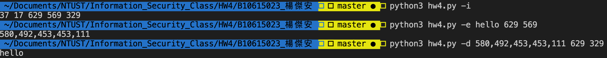
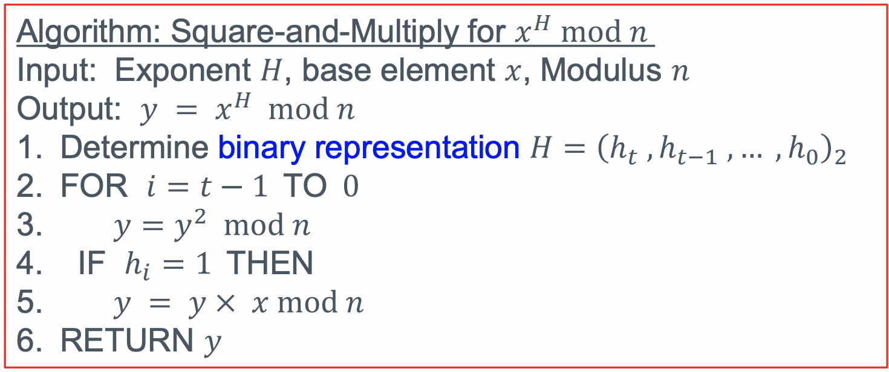

# B10615023 楊傑安 HW4 說明文件

## 建置環境
- MacOS 10.14.6
- python 3.7

## 操作⽅式
### 初始化
  - % > `python3 hw4.py -i`
  - output:`{p} {q} {n} {e} {d}`
### 加密
  - % > `python3 hw4.py -e {plaintext} {n} {e}`
    - e.g. `python3 hw4.py -e hello 629 569`
  - output:{ciphertext}
### 解密
- % > `python3 hw4.py -d {ciphertext} {n} {d}`
  - e.g. `python3 hw4.py -d 580,492,453,453,111 629 329`
- output:{plaintext}

## 執行結果圖


## 程式碼解說
### main function、caller、exception handler:
  ``` python
def exception(mode,argv):
    print("No such mode:"+mode)

def caller(mode,argv):
    mode_map = {
        "-i" : init,
        "-e" : encrypt,
        "-d" : decrypt
    }
    function=mode_map.get(mode,exception)
    if function:
        function(mode,argv)
    else:
        print("arguments error")
        
if __name__ == "__main__":
    caller(argv[1],argv)
  ```
- 用來處理terminal輸入、對應到相對應的function且call function
- 若輸入的參數數量有誤輸出`arguments error`
- 若輸入不支援的模式輸出`No such mode:+[mode]`

### 初始化
```python
def init(mode,argv) :
    p = generate_big_prime(6)
    while not is_prime(p):
        p = generate_big_prime(6)
    q = generate_big_prime(5)
    while not is_prime(q):
        q=  generate_big_prime(5)
    n=p*q
    phi_of_n=(p-1)*(q-1)
    e = randint(2,phi_of_n)
    while gcd(e,phi_of_n) != 1:
        e = randint(2,phi_of_n)
    d = inverse(e,phi_of_n)
    print(p,q,n,e,d)
```
- 首先產生2個爲5、6 bits的數字
  - 若不是質數則重新產生
- 計算n,phi(n)
- 在[2,phi(n))中隨機取一個數當作e
  - 若e,phi(n)沒有互質則重新取e(因無法保證e有mod反元素)
- 計算d的mod反元素
- 輸出p,q,n,e,d

### 檢查n是否爲質數
```python
def is_prime(n):
    for i in range(2,n//2+1):
        if n%i == 0:
            return False
    return True
```
- 找出[2,$n \over 2$]內有沒有n的因數
  - 如果有則return false
  - 反之return true

### 產生可能的大質數
```python
def generate_big_prime(bits):
    binary=""
    for i in range(bits-2):
        if(random()>0.8):
            binary+="1"
        else:
            binary+="0"
    binary="1"+binary+"1"
    return int(binary,base=2)
```
- 此方法可以產生一個大奇數
- 產生(bits-2)個“0”或“1”的character的string
- 在頭尾加上“1”
- 轉成整數並return

### 尤拉函數$\phi(n)$
```python
def phi(n):
    if is_prime(n):
        return n-1
    else:
        count=0
        for i in range(0,n):
            if gcd(n,i)==1:
                count+=1
        return count
```
- 如果n是質數則return (n-1)
- 否則一一計算$\leqq n$的數是否和n互質,並return數量

### square and multiply
```python
def square_and_multiply(base,exponent,mod):
    to_return = base
    exponent_binary=[int(i) for i in bin(exponent)[2:]]
    for i in exponent_binary[1:]:
        to_return=(to_return**2)%mod
        if i == 1:
            to_return=(to_return*base)%mod
    return to_return
```
- 將y(to_return)設成base後依照課程ppt


### mod指數
```python
def exponent_mod(base,exponent,mod):
    return square_and_multiply(base,exponent,mod)
```
- 直接call square and multiply

### 計算反元素
```python
def inverse(e,n):
    return exponent_mod(e,phi(n)-1,n)
```
- 利用尤拉定理
  - modular inverse of e mod n = $e^{\phi (n)-1} \text{ mod } n$

### 加密
```python
def encrypt(mode,argv):
    text=[]
    for ch in argv[2]:
        text.append(ord(ch))
    n=int(argv[3])
    e=int(argv[4]) 
    cipher=[]
    for ch in text:
        cipher.append(str(exponent_mod(ch,e,n))) 
    print(",".join(cipher))
```
- 將plaintext拆成一個一個的ASCII code值(ch)
- 對每一個ch做$ch^{e} \text{mod } n$
- 把每一個加密後的值用 `,` 隔開後輸出

### 解密
```python
def decrypt(mode,argv):
    text=argv[2].split(",")
    cipher=[]
    for ch in text:
        cipher.append(int(ch))
    n=int(argv[3])
    d=int(argv[4]) 
    plain=[]
    for ch in cipher:
        plain.append(chr(exponent_mod(ch,d,n))) 
    print("".join(plain))
```
- 將輸入的值以 `,`隔開(ch)
- 對每一個ch做$ch^{d} \text{mod } n$
- 再把每一個解密後的值從ASCII code轉回charcter
- 相連之後輸出

## 遇到困難與⼼得
- 這次的CRT比較困難直接果斷放棄
- 本來有打算實作Miller-Rabin Test,但是因為我的計算inverse的方式是用尤拉定理,如果有一個合數躲過Miller-Rabin Test到了產生inverse的地方會直接產生一個不是inverse的值,
  - 據說另一個產生inverse的方法是利用egcd,如果產生的e和$\phi(n)$沒有互質,在計算的時候可以直接發現進而處理
- 因為效能關係,我的code只支援小數字的RSA和square and multiply
  - 但實際上是可以產生大質數只是無法驗證
- 在test的時候我用了太小的p,q,以至於我的n小於0x7A(可視字元的ASCII code上限),導致我在加解密mod的時候直接把值壓得太小,我花了很多的時間才發現這個bug